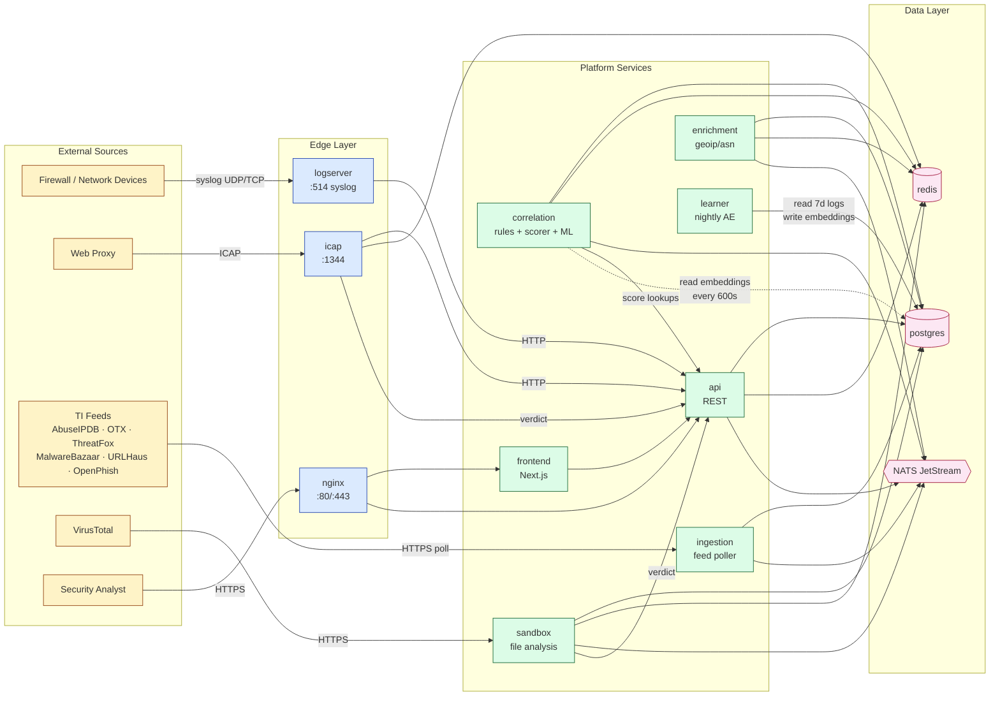
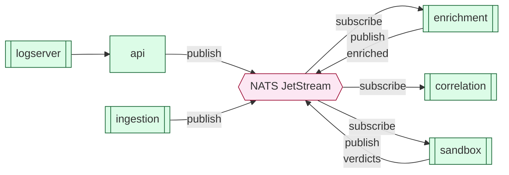

# Full System Topology #service

The entire platform at one glance. Click any node to jump to its detailed note.

## High-level data flow

## NATS subject map

## Redis database allocation #gotcha

| DB | Service | Purpose |
|----|---------|---------|
| 0 | [[architecture/services/api]] | sandbox progress + general cache |
| 1 | [[architecture/services/ingestion]] | feed dedup + rate-limit |
| 2 | [[architecture/services/enrichment]] | geoip cache |
| 3 | [[architecture/services/icap]] | verdict cache |
| 4 | [[architecture/services/correlation]] | dedup + leader election state |
| 5 | [[architecture/services/sandbox]] | analysis queue |

## Network segmentation

- **`ti-internal`** — all service-to-service traffic (postgres, redis, nats, internal HTTP)
- **`ti-dmz`** — only services with external exposure: nginx, icap, logserver

## Service catalogue

| Service | Layer | Note |
|---|---|---|
| [[architecture/services/postgres]] | data | primary store |
| [[architecture/services/redis]] | data | cache + dedup |
| [[architecture/services/nats]] | data | message bus |
| [[architecture/services/api]] | platform | REST surface |
| [[architecture/services/ingestion]] | platform | TI feed puller |
| [[architecture/services/enrichment]] | platform | geo/asn enrichment |
| [[architecture/services/correlation]] | platform | detection brain |
| [[architecture/services/sandbox]] | platform | file detonation |
| [[architecture/services/learner]] | platform | M3 nightly AE |
| [[architecture/services/icap]] | edge | web-proxy hook |
| [[architecture/services/logserver]] | edge | syslog receiver |
| [[architecture/services/frontend]] | edge | Next.js UI |
| [[architecture/services/nginx]] | edge | reverse proxy |
| [[architecture/services/prometheus]] | obs | metrics |
| [[architecture/services/grafana]] | obs | dashboards |

> See [[product/overview]] for the selling-deck-friendly version.
