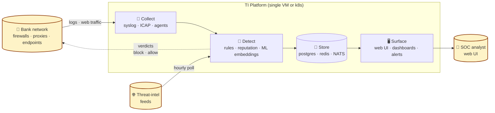
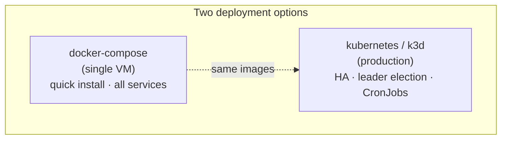

# TI Platform — Product Overview

**One-liner:** A self-hosted Threat Intelligence platform that watches a bank's network and tells the SOC what's actually worth their time — using rules, threat-intel feeds, and learned per-customer behaviour.

## Why a bank cares

| Pain                                                   | What we do                                                                           |                                                       |
| ------------------------------------------------------ | ------------------------------------------------------------------------------------ | ----------------------------------------------------- |
| SOC drowning in firewall alerts                        | Reputation scorer ranks every event; only the high-score ones surface as alerts      |                                                       |
| New malware slips past signatures                      | Behavioural learning ([[milestones/M3-embeddings                                     | M3]]) flags hosts behaving unlike their normal selves |
| Threat-intel feeds bought separately, never correlated | We pull AbuseIPDB, OTX, ThreatFox, MalwareBazaar, URLHaus, OpenPhish into one engine |                                                       |
| File downloads can't be inspected at the proxy         | ICAP integration scans HTTP file flows, sandboxes suspicious binaries                |                                                       |
| Compliance wants explainable detections                | Every alert ships with the score breakdown — no black box                            |                                                       |

## What's deployed today

- ✅ Reputation Scorer ([[milestones/M1-reputation|M1]]) — 16-signal weighted score
- ✅ Enforcement mode ([[milestones/M2-enforce|M2]]) — scoring actually shapes alert volume
- ✅ Behavioural Embeddings ([[milestones/M3-embeddings|M3]]) — host & destination autoencoder vectors
- ✅ Adaptive baselines per host (z-score anomaly detection)
- ✅ ICAP web-traffic inspection
- ✅ File sandboxing (mock / VirusTotal / dockerized dynamic)
- ✅ Analyst UI with explainable scoring

## Pitch-deck diagram

## Three things that differentiate us

### 1. Learned, per-customer behaviour
> Two banks have totally different normal traffic. Generic ML signatures false-positive constantly. We train a tiny autoencoder ([[milestones/M3-embeddings|details]]) on each customer's last 7 days nightly. The detection thinks like *that bank*, not the average bank.

### 2. Explainable scoring
> Every alert shows the **weight breakdown**: e.g. `+2.0 ti_match, -1.0 baseline_match, +1.0 learned_similarity, -0.8 tranco`. Compliance officers and auditors get full transparency.

### 3. One platform, not five products
> Replaces (or augments) what's typically 4-5 separate vendors: SIEM correlation, TI feed aggregator, web content filter, file sandbox, behavioural analytics. Single deploy, single UI, single billing line.

## Deployment model

- **PoC**: docker-compose up, point firewall syslog at port 514, point browser at port 443. Done.
- **Production**: helm chart on k3d/k8s. Currently running on `192.168.3.210` cluster `ti-k8s` namespace `ti`.

## Numbers from a live deployment

(2026-04-24 snapshot, [[daily/2026-04-24]])

| Metric | Value |
|---|---|
| Logs ingested (last 7d) | ~1.5M firewall events |
| Hosts with behavioural embeddings | 58 |
| Destinations modelled | 5,118 |
| AE training time | ~30s (CPU only) |
| AE final loss | 0.59 (started 9.44) |
| Alert volume after [[milestones/M2-enforce|enforce flip]] | dropped to **0** in 15-min window (from 233/24h baseline) |
| Score-time inference | sub-millisecond |

## Total footprint

| Resource | Sizing |
|---|---|
| Postgres | 2 GB RAM, ~5 GB disk per month (firewall-grade) |
| Redis | 512 MB RAM |
| All app services combined | ~4 GB RAM |
| Single-VM deploy | 8 GB RAM, 4 vCPU, 100 GB disk |

## See also
- [[architecture/topology]] — full technical architecture
- [[milestones/M4-roadmap]] — what's coming next
- [[product/competitor-landscape]] *(stub — fill when needed)*
- [[product/pricing-model]] *(stub — fill when needed)*
